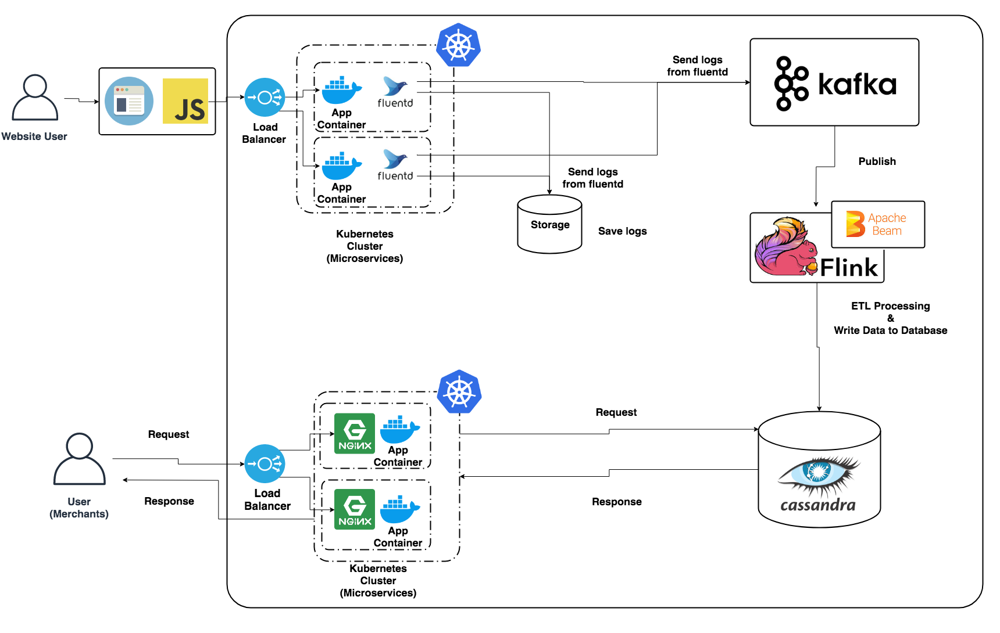

# Design Question
## Requirements
- We need to provide Google Analytic like services to our customers.
- Feel free to choose any open source tools as you want.
```
1) handle large write volume: Billions write events per day.

2) handle large read/query volume: Millions merchants want to get insight about their business. Read/Query patterns are time-series related metrics. 

3) provide metrics to customers with at most one hour delay.

4) run with minimum downtime.

5) have the ability to reprocess historical data in case of bugs in the processing logic.
```

## Requirements Analysis
1. With 1 billion writes a day, the system needs to be able to write about 12000 times per second.
1. With 1 million reads a day, the system needs to be able to read about 12 times per second.
1. The system need to be able to see metrics with a delay of up to one hour, so the system need real-time processing rather than batch processing.
1. Assuming the system build on a public cloud such as AWS, assume a availability of 99.5% to 99.9%, which slightly lowers than SLA of the public cloud.
1. If there is a bug, the system needs to keep the log in storage etc. to be able to re-process.

## System Overview


## Selected Software and Design
### Kubernetes
1. Receive the information sent from the website, process the log, send log to fluentd. Place fluentd as a sidecar.
1. Run an application that provides features such as metrics visualization for users such as site administrators. Nginx places in front of applications to obtain access logs and to perform rate limiting.
- Each service scales out containers to maintain high availability. In addition, Kubernetes, a de facto standard for container orchestration tools. I selected it in order to maintain the required number of containers even if the container stopped.

### fluentd
- Used to transfer logs to object storage and Kafaka.
- Using fluntd to separate the log transfer responsibilities from the application. As the application tries to transfer the logs to object storage and Kafaka, which complicates redoing and file write persistence to the local volume.
- I selected Fluentd because there are many cases where fluentd is used for log transfer and there are plugins for AWS-S3 and GCP-GCS.

### Apache Kafka
- Use as a distributed message queue that transfers large amounts of log data to the ETL server in real time, sending data to Flink.
- A few months' worth of data is stored so that data can be transferred back to the ETL server if processing is necessary due to a bug etc.
- I selected Kafka, which has both high availability and real-time compatibility, and can store messages for a fixed period of time.

### Apache Flink + Apache Beam
- Perform streaming ETL processing to save log data.
- It also execute batch processing when you want to execute processing due to a bug or the like, but you do not want to execute it with streaming processing currently in progress.
- I selected Flink because it can perform streaming and batch processing, it has helped Alibaba to pull off one successful 11.11 Shopping Festival after another.
	- [A Flink Series from the Alibaba Tech Team](https://medium.com/@alitech_2017/a-flink-series-from-the-alibaba-tech-team-b8b5539fdc70)
	- > For the most recent 11.11 of 2018, the Flink engine smoothly supported real-time traffic peaking at 1.7 billion transactions per second.
- I selected Apache Beam as a processing model because it supports both streaming processing and batch processing and supports multiple execution environments.

### Apache Cassandra
- Used to save the results of ETL processing.
- I selected Cassandra, which has high availability and excellent writing performance.

### Nginx
- Used for access log acquisition and rate limiting.
- I selected Nginx, which is good at mass access processing among web servers.

### Object Storage
- Save the log sent from fluentd. Used when it is necessary to reprocess due to a bug or the like.

### Load Balancer
- Used to balance user traffic.

